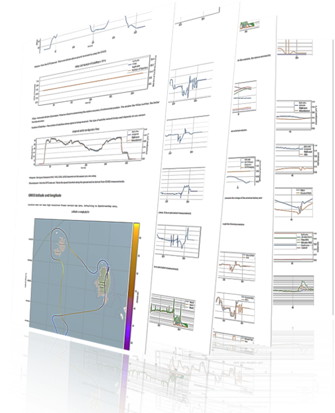
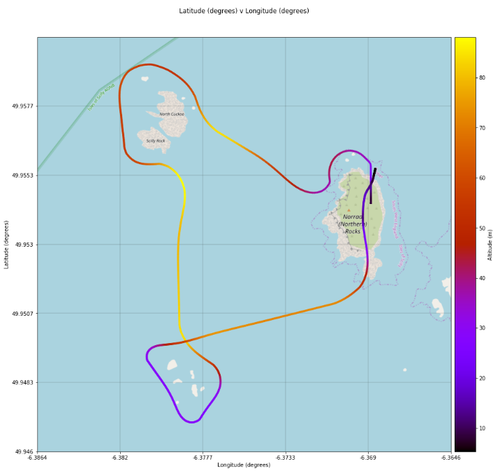

========
AutoFLpy
========

.. image:: https://img.shields.io/pypi/v/autoflpy.svg
        :target: https://pypi.python.org/pypi/autoflpy

.. image:: https://img.shields.io/travis/AdrianWeishaeupl/autoflpy.svg
        :target: https://travis-ci.org/AdrianWeishaeupl/autoflpy

.. image:: https://readthedocs.org/projects/autoflpy/badge/?version=latest
        :target: https://autoflpy.readthedocs.io/en/latest/?badge=latest
        :alt: Documentation Status

AutoFLpy (Automated Flight Log python) is an open source code to allow you to create agile flight reports. This code rapidly creates flight reports for the user given an input file in a matter of minutes and is ideal for a complete analysis and evaluation of flight data. Multiple input data sources are accepted, with the report combining these into a succinct and overseeable document.

* Free software: GPLv3
* Documentation: https://autoflpy.readthedocs.io/
* GitHub repository: https://github.com/AdrianWeishaeupl/AutoFLpy/
* PyPI: https://pypi.org/project/autoflpy/

Features
--------

* Generates a highly customisable and agile flight summary report using data from .log and input files.
* Default flight summary includes:
	* Plots for (Note 1):
		* GPS altitude and velocity.
		* GPS latitude and longitude plotted on a map Note 2.
		* Control inputs throughout the flight.
		* Barometric data throughout the flight.
		* Flight attitude throughout the flight.
		* Flight computer vibrational data.
		* Additional csv and `Arduino <https://www.arduino.cc/>`_ data.
	* METAR information of the nearest airfield.
* Multi-flight simultaneous analysis for comparing different flights.
* Sample data files included. This will be **created when the code is run for the first time**.
* Full choice of file paths for the data and outputs can be specified using the input file.

Note 1 -  If the raw data has been recorded and supplied.

Note 2 -  For this feature to work, both `geopandas <https://geopandas.org/>`_ and `contextily <https://github.com/darribas/contextily>`_ need to be installed on the local machine. This needs to be done by the user due to difficulty installing these on various operating systems. A short help guide is attached in the installation instructions.

Disclaimer
----------
The examples provided should not be taken to mean that that flights have actually taken place in the areas shown, nor that anyone may have permission to conduct such flights. This software is offered in the hope that it may be useful to users conducting safe and legal drone operations, but the authors offer no guarantees and accept no legal responsibilities in relation to its use. Please ensure that you are aware of and obey all relevant laws, rules and regulations in your jurisdiction (UK users should follow the `Drone Code <https://dronesafe.uk/drone-code/>`_).

Credits
-------

This package was created with Cookiecutter_ and the `audreyr/cookiecutter-pypackage`_ project template.

.. _Cookiecutter: https://github.com/audreyr/cookiecutter
.. _`audreyr/cookiecutter-pypackage`: https://github.com/audreyr/cookiecutter-pypackage

Runways.csv adapted from https://github.com/sobester/ADRpy
