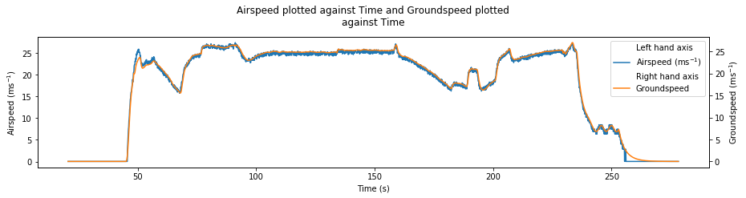

========
AutoFLpy
========

.. image:: https://img.shields.io/pypi/v/autoflpy.svg
        :target: https://pypi.python.org/pypi/autoflpy

.. image:: https://img.shields.io/travis/AdrianWeishaeupl/autoflpy.svg
        :target: https://travis-ci.org/AdrianWeishaeupl/autoflpy

.. image:: https://readthedocs.org/projects/autoflpy/badge/?version=latest
        :target: https://autoflpy.readthedocs.io/en/latest/?badge=latest
        :alt: Documentation Status

Autoflpy (Automated flight log python) is an open source code to allow you to create customisable flight logs in the field. This code automatically creates flight logs for the user given an input file. It currently works with ardupilot log files taken from the flight computer in the .bin format and converted into the .log format using Mission Planner.

* Free software: GPLv3
* Documentation: https://autoflpy.readthedocs.io.

Features
--------

* Generates a highly customisable flight summary using data from .log and input files.
* Default flight summary includes:
	* METAR information of the nearest airfield.
	* Checklist Information (if provided).
	* Plots for:
		* GPS altitude and velocity.
		* GPS latitude and longitude plotted on a map**.
		* Control inputs throughout the flight.
		* Barometric data throughout the flight.
		* Flight attitude throughout the flight.
		* Flight computer vibrational data.
		* Additional arduino data (if supplied).
* Sample data files included. This will be **created when the code is run for the first time**.
* Full choice of file paths for the data and outputs can be specified using the input file.

** For this feature to work, both geopandas and contextily need to be installed on the local machine. This needs to be done by the user due to difficulty installing these on various operating systems. A short help guide is attached in the installation instructions.

.. image:: images/SITL_flight_map.png
	:width: 700
	:alt: Image of a flight plotted over a map using AutoFLpy.

Credits
-------

This package was created with Cookiecutter_ and the `audreyr/cookiecutter-pypackage`_ project template.

.. _Cookiecutter: https://github.com/audreyr/cookiecutter
.. _`audreyr/cookiecutter-pypackage`: https://github.com/audreyr/cookiecutter-pypackage

Runways.csv taken from https://github.com/sobester/ADRpy
