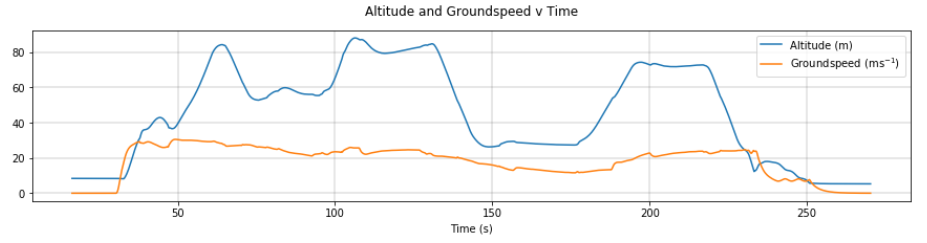
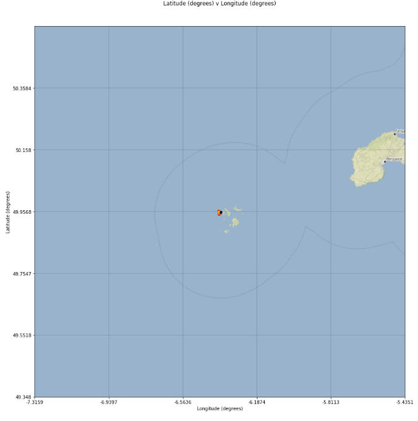
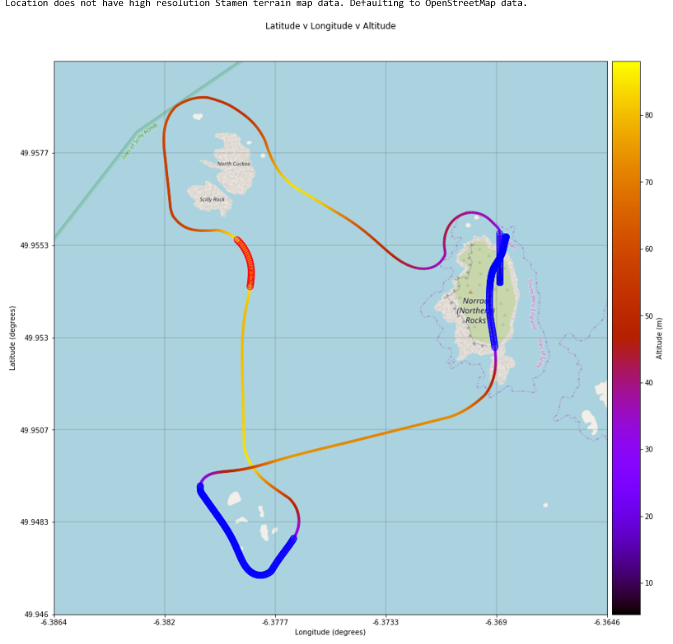
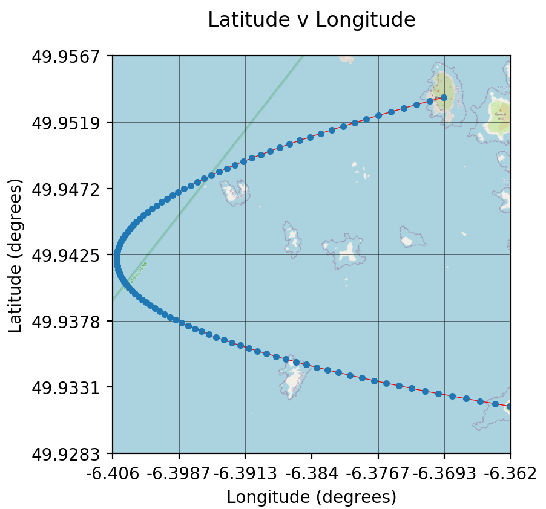
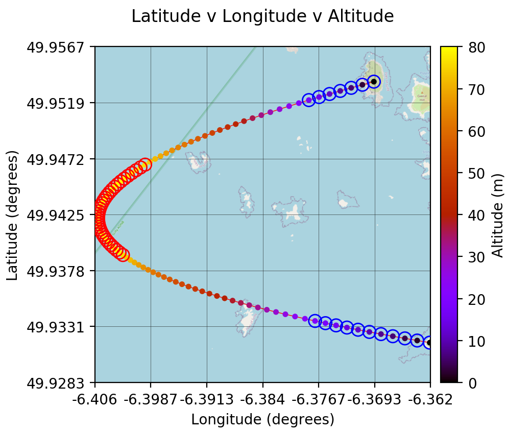

Examples
========

log_analysis.autoflpy
---------------------

To activate the METAR feature, set include_metar to True. This feature is only available when a single flight is being analysed. Default is False::

	log_analysis.autoflpy(input_file='Input_File.json', include_metar=True)

Once the xlsx files for the flight in question have been generated, the report generation time can be reduced by setting run_log_to_xlsx to False. This can be useful for re-plotting the flight with a different template or for comparing two or more flights that have previously been plotted. Default is True::

	log_analysis.autoflpy(input_file='Input_File.json', run_log_to_xlsx=False)

The following section contains examples on how to use the Jupyter Notebook generated through AutoFLpy.

Graph Plotter Examples
----------------------

Once AutoFLpy has been run, a Jupyter Notebook is generated. This can be opened using Jupyter Notebook and run to generate the requested graphs.

The graph_plotter is used to plot simple data such as the following altitude plot::

	x_limits = ["x_min", "x_max"]
	y_limits = ["y_min", "y_max"]
	graph_plotter([["y", "altitude", "gps"], ["x", "time", "gps"]],
		values_list, x_limits, y_limits, marker_list)

.. image:: images/Ex_alt_v_time_1.png
	:width: 900
	:align: center
	:alt: Image of a graph generated with AutoFLpy showing altitude plotted against time.

The code cell above the graph is used to define variables used in the plot such as the axes limits and variables used in the function itself. The axes limits (x_limits and y_limits) can be changed and the code re-run to generate a view of a more precise section of the plot::

	x_limits = [45, 90]
	y_limits = [30, 85]
	graph_plotter([["y", "altitude", "gps"], ["x", "time", "gps"]], 
		values_list, x_limits, y_limits, marker_list)

.. image:: images/Ex_alt_v_time_2.png
	:width: 900
	:align: center
	:alt: Image of a graph generated with AutoFLpy showing a section of the altitude v time plot.

Variables in the same data group (in this case "gps") can be plotted on the same graph either by changing the Notebook template (recommended) or by inserting the data tag (eg. ["y", "groundspeed", "gps"]) into the function::

	x_limits=["x_min", "x_max"]
	y_limits=["y_min", "y_max"]
	graph_plotter([["y", "altitude", "gps"], ["y", "groundspeed", "gps"],
		["x", "time", "gps"]], values_list, x_limits, y_limits,
		marker_list)

If two variables are from different data sets, there is a good chance that they were sampled at different frequencies. For this, the multiaxes plotter function can be used. This function works under the same principle as the function mentioned above but allows for several data sets to be plotted::

	x_limits=["x_min", "x_max"]
	y_limits_left=["y_min", "y_max"]
	y_limits_right=["y_min", "y_max"]
	legend_location=1
	multiaxis_graph_plotter([["y", "airspeed", "arsp"], ["x", "time", "arsp"]],
		[["y", "altitude", "gps"], ["x", "time", "gps"]], values_list,
		x_limits, y_limits_left, y_limits_right, marker_list, legend_location)

.. image:: images/Ex_arsp_alt_v_time_1.png
	:width: 900
	:align: center
	:alt: Image of a graph generated with AutoFLpy showing altitude and airspeed v time.

The arm and disarm times can be added to both multi-variable and standard graphs. This is done through the addition of the arm_data variable. The time between the arm and disarm will also be calculated::

	x_limits=["x_min", "x_max"]
	y_limits=["y_min", "y_max"]
	graph_plotter([["y", "altitude", "gps"], ["x", "time", "gps"]], 
		values_list, x_limits, y_limits, marker_list, arm_data=True)

.. image:: images/Ex_alt_v_time_4.png
	:width: 900
	:align: center
	:alt: Image of a graph generated with AutoFLpy showing the altitude v time plot as well as the times when it was armed and disarmed.

For marking specific flight points across all graphs simultaneously, define your markers in the marker_list as a list of numbers. Below is an example marking the two highest points in the flight on the altitude figure and displaying these in the airspeed and groundspeed figure.

.. image:: images/Ex_markers.png
	:width: 900
	:align: center
	:alt: Image of a graph generated with AutoFLpy showing the use of custom markers on various plots.

Plotting Maps
-------------

This is a special feature of the graph plotter and allows for a top down visualisation of the flight and surrounding area. To activate this feature, plot latitude against longitude. Two maps will be generated, one of the immediate flight area and one of the region::

	x_limits=["x_min", "x_max"]
	y_limits=["y_min", "y_max"]
	graph_plotter([["y", "latitude", "gps"], ["x", "longitude", "gps"]],
		values_list, x_limits, y_limits, marker_list)

.. image:: images/SITL_flight_map.png
	:width: 900
	:align: center
	:alt: Image of zoomed in map generated using Software In The Loop.

The scale of the second plot can be changed through the addition of the scale variable::

	x_limits=["x_min", "x_max"]
	y_limits=["y_min", "y_max"]
	graph_plotter([["y", "latitude", "gps"], ["x", "longitude", "gps"]], 
		values_list, x_limits, y_limits, marker_list, scale=0.001)

.. image:: images/SITL_flight_map_out_2.png
	:width: 900
	:align: center
	:alt: Image of zoomed in map generated using Software In The Loop.

The colour of the additional variable on the map plot can be defined by any third varible for which data is present. This is done through the addition of the map_info variable. The following examplke demonstrates this with airspeed::

	x_limits=["x_min", "x_max"]
	y_limits=["y_min", "y_max"]
	graph_plotter([["y", "latitude", "gps"], ["x", "longitude", "gps"]], 
		values_list, x_limits, y_limits, marker_list, map_info=["airspeed", "arsp"])

.. image:: images/SITL_flight_map_3.png
	:width: 900
	:align: center
	:alt: Image of zoomed in map generated using Software In The Loop showing airspeed on the colour axes.

To set limits in the map plot, the map_info_limits argument can be used. map_info_limits are limits to be applied in to the map_info data in the form [lower_limit, upper_limit]. If only one limit is required, enter the other limit as None. This colours any points below the lower_limit in blue and any above the upper_limit in red. Below is an example with altitudes below 25 m and above 85 m marked.::

	x_limits=["x_min", "x_max"]
	y_limits=["y_min", "y_max"]
	graph_plotter([["y", "latitude", "gps"], ["x", "longitude", "gps"]],
		values_list, x_limits, y_limits, marker_list, map_info_limits=[30, 85])

Stand alone maps - backplt_map
------------------------------

The above mentioned functions can also be used externally to plot latitude and longitude data. Using this returns a matplotlib pyplot figure object which can be customised before showing. Import the backplt_map from autoflpy.util.plotting to use the function.

Sample data::

	
	latitudes = [49.953711  , 49.95345004, 49.9531899 , 49.95293059, 49.9526721 ,
		   49.95241445, 49.95215761, 49.95190161, 49.95164643, 49.95139208,
		   49.95113855, 49.95088585, 49.95063398, 49.95038293, 49.95013271,
		   49.94988331, 49.94963474, 49.949387  , 49.94914009, 49.948894  ,
		   49.94864873, 49.9484043 , 49.94816069, 49.9479179 , 49.94767594,
		   49.94743481, 49.94719451, 49.94695503, 49.94671638, 49.94647855,
		   49.94624155, 49.94600538, 49.94577003, 49.94553551, 49.94530181,
		   49.94506895, 49.9448369 , 49.94460569, 49.9443753 , 49.94414574,
		   49.943917  , 49.94368909, 49.94346201, 49.94323575, 49.94301032,
		   49.94278571, 49.94256193, 49.94233898, 49.94211686, 49.94189556,
		   49.94167508, 49.94145544, 49.94123662, 49.94101862, 49.94080145,
		   49.94058511, 49.9403696 , 49.94015491, 49.93994105, 49.93972801,
		   49.9395158 , 49.93930442, 49.93909386, 49.93888413, 49.93867522,
		   49.93846715, 49.93825989, 49.93805347, 49.93784787, 49.9376431 ,
		   49.93743915, 49.93723603, 49.93703374, 49.93683227, 49.93663163,
		   49.93643181, 49.93623282, 49.93603466, 49.93583733, 49.93564082,
		   49.93544513, 49.93525028, 49.93505625, 49.93486304, 49.93467066,
		   49.93447911, 49.93428839, 49.93409849, 49.93390942, 49.93372117,
		   49.93353375, 49.93334716, 49.93316139, 49.93297645, 49.93279233,
		   49.93260905, 49.93242658, 49.93224495, 49.93206414, 49.93188416,
		   49.931705  ]

	longitudes = [-6.369436  , -6.37093546, -6.37240315, -6.37383906, -6.37524321,
		   -6.37661558, -6.37795618, -6.379265  , -6.38054206, -6.38178734,
		   -6.38300085, -6.38418259, -6.38533255, -6.38645074, -6.38753716,
		   -6.38859181, -6.38961469, -6.39060579, -6.39156512, -6.39249268,
		   -6.39338847, -6.39425248, -6.39508472, -6.39588519, -6.39665389,
		   -6.39739081, -6.39809596, -6.39876934, -6.39941095, -6.40002079,
		   -6.40059885, -6.40114514, -6.40165966, -6.4021424 , -6.40259338,
		   -6.40301258, -6.40340001, -6.40375566, -6.40407955, -6.40437166,
		   -6.404632  , -6.40486057, -6.40505736, -6.40522238, -6.40535563,
		   -6.40545711, -6.40552682, -6.40556475, -6.40557091, -6.4055453 ,
		   -6.40548792, -6.40539876, -6.40527783, -6.40512513, -6.40494066,
		   -6.40472441, -6.40447639, -6.4041966 , -6.40388504, -6.40354171,
		   -6.4031666 , -6.40275972, -6.40232107, -6.40185064, -6.40134845,
		   -6.40081448, -6.40024874, -6.39965122, -6.39902194, -6.39836088,
		   -6.39766805, -6.39694345, -6.39618707, -6.39539892, -6.394579  ,
		   -6.39372731, -6.39284385, -6.39192861, -6.3909816 , -6.39000282,
		   -6.38899227, -6.38794994, -6.38687584, -6.38576997, -6.38463233,
		   -6.38346291, -6.38226172, -6.38102876, -6.37976403, -6.37846753,
		   -6.37713925, -6.3757792 , -6.37438738, -6.37296378, -6.37150842,
		   -6.37002128, -6.36850237, -6.36695168, -6.36536923, -6.363755  ,
		   -6.362109  ]

	gps_time = [  0.,   1.,   2.,   3.,   4.,   5.,   6.,   7.,   8.,   9.,  10.,
			11.,  12.,  13.,  14.,  15.,  16.,  17.,  18.,  19.,  20.,  21.,
			22.,  23.,  24.,  25.,  26.,  27.,  28.,  29.,  30.,  31.,  32.,
			33.,  34.,  35.,  36.,  37.,  38.,  39.,  40.,  41.,  42.,  43.,
			44.,  45.,  46.,  47.,  48.,  49.,  50.,  51.,  52.,  53.,  54.,
			55.,  56.,  57.,  58.,  59.,  60.,  61.,  62.,  63.,  64.,  65.,
			66.,  67.,  68.,  69.,  70.,  71.,  72.,  73.,  74.,  75.,  76.,
			77.,  78.,  79.,  80.,  81.,  82.,  83.,  84.,  85.,  86.,  87.,
			88.,  89.,  90.,  91.,  92.,  93.,  94.,  95.,  96.,  97.,  98.,
			99., 100.]

	altitude = [0, 60, 80, 80, 40, 0]
	altitude_time = [0, 20, 30, 60, 80, 100]
	

For simply plotting the points on the map, only the location data and associated times are required::

	from autoflpy.util.plotting import backplt_map
	figure = backplt_map(latitudes, longitudes, gps_time)
	figure.show()

An additional variable can be added as the z_var (in this case, altitude data) as follows. This requires data and a corresponding time series that overlaps with the latitude/longitude data. A name and unit can be added as a string and should be an empty string if not desired. Print statements can also be removed using disable_prints=True.::

	from autoflpy.util.plotting import backplt_map
	figure = backplt_map(latitudes, longitudes, gps_time, z_var="Altitude",
		z_var_data=altitude, z_var_time_data=altitude_time, z_var_unit="m",
		disable_prints=True)
	figure.show()

Just as in the graph_plotter, outliers can also be marked on the plot by using the z_var_limits and entering a desired list containing an upper and lower bound.::

	from autoflpy.util.plotting import backplt_map
	figure = backplt_map(latitudes, longitudes, gps_time, z_var="Altitude", 
		z_var_data=altitude, z_var_time_data=altitude_time, z_var_unit="m",
		z_var_limits=[20, 75], disable_prints=True)
	figure.show()

Take-off Graphs
---------------

Take-off graphs can be generated using the take_off_graph function. This allows the user to quickly plot the variables that influence the take off of the UAV. In it's most basic form, this function detects the take off and plots 5 figures focused around the take-off. The take off point is gound using the GPS data provided. If the function does not automatically detect the take off it can be entered manually using the take_off_time argument. Sensitivity of the take-off detection can be adjusted in the alt_sensitivity and groundspeed_sensitivity arguments. Markers and arm data work as normally described.

The following figure shows the use of this feature.::

	take_off_graph(values_list)

.. image:: images/Ex_take_off.png
	:width: 900
	:align: center
	:alt: Image of the take off data plotted through the take_off_graph function.

Multiple Flight Comparison
--------------------------

AutoFLpy allows for the user to compare multiple flights in the same Jupyter Notebook. To do this, data should be entered into the Input_File.json for each flight separated by a ",". For example::

	"log_to_xlsx_input": {
			"log_file_name": "Flight1.log, Flight2.log",
			"log_file_path": "",
			"excel_data_file_path": "",
			"date": "20190309, 20190209",
			"flight_number": "1, 2"}

Variables are entered into the plotting functions as usual and plotted for both sets of data if present. Some functionality is reduced including the automated take-off detection (reverted to manual only) and plotting the arm data when plotting multiple flights simultaneously.

To aid with the lining up of data, the time_x_offset argument can be added to the plot to allow the user to shift the data along the time axis. It should only be used in the first figure to be plotted and, as it directly edits the imported data, all subsequent figures will be plotted with the new data. This argument takes one number for each flight being plotted and subtracts this from the time data::

	x_limits=["x_min", "x_max"]
	y_limits=["y_min", "y_max"]
	graph_plotter([["y", "altitude", "gps"], ["x", "time", "gps"]], 
		values_list, x_limits, y_limits, marker_list,
		time_x_offset=[-32.5, -187.5])

.. image:: images/Ex_time_x_offset.png
	:width: 900
	:align: center
	:alt: Image of two simulated flights with the time axes shifted through the time_x_offset argument.

