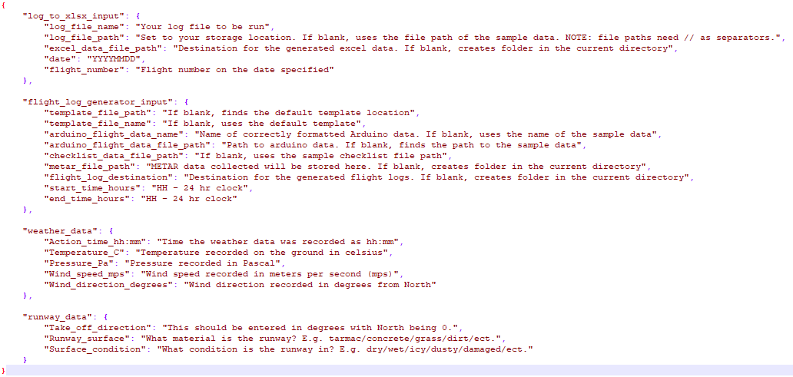
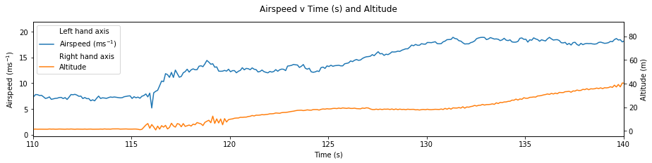

=====
Usage
=====

First time users
----------------

AutoFLpy is a code designed to allow drone pilots and operators to easily analyse flight data in the field. It works by reading the data collected by the flight computer (eg. PixHawk) and plotting the data in a Jupyter Notebook. This notebook is fully customisable and allows the user to plot any variable collected by its self or with other data in the same plot.

**Upon first time running of the script, sample data will be used to create a sample flight log for the user to look at for inspiration.** 
A folder structure containing the "Input_File.json" and base file paths will also be created. The user can then complete the "Input_File.json" with appropriate information and analyse their own flight data.

The template is structured as follows::

	{
		"log_to_xlsx_input": {
			"log_file_name": "Your log file to be run",
			"log_file_path": "Set to your storage location. If blank, uses the file path of the sample data. NOTE: file paths need // as separators.",
			"excel_data_file_path": "Destination for the generated excel data. If blank, creates folder in the current directory",
			"date": "YYYYMMDD",
			"flight_number": "Flight number on the date specified"
		},
		
		"flight_log_generator_input": {		
			"template_file_path": "If blank, finds the default template location",
			"template_file_name": "If blank, uses the default template",
			"arduino_flight_data_name": "Name of correctly formatted Arduino data. If blank, uses the name of the sample data",
			"arduino_flight_data_file_path": "Path to arduino data. If blank, finds the path to the sample data",
			"checklist_data_file_path": "If blank, uses the sample checklist file path",
			"metar_file_path": "METAR data collected will be stored here. If blank, creates folder in the current directory",
			"flight_log_destination": "Destination for the generated flight logs. If blank, creates folder in the current directory",
			"start_time_hours": "HH - 24 hr clock",
			"end_time_hours": "HH - 24 hr clock"
		},
		
		"weather_data": {
			"Action_time_hh:mm": "Time the weather data was recorded as hh:mm",
			"Temperature_C": "Temperature recorded on the ground in celsius",
			"Pressure_Pa": "Pressure recorded in Pascal",
			"Wind_speed_mps": "Wind speed recorded in meters per second (mps)",
			"Wind_direction_degrees": "Wind direction recorded in degrees from North"
		},
		
		"runway_data": {
			"Take_off_direction": "This should be entered in degrees with North being 0.",
			"Runway_surface": "What material is the runway? E.g. tarmac/concrete/grass/dirt/ect.",
			"Surface_condition": "What condition is the runway in? E.g. dry/wet/icy/dusty/damaged/ect."
		}
	}

-----------------

To use AutoFLpy::

    from autoflpy import log_analysis

Individual flight logs can be generated using the log_analysis function::

	log_analysis.autoflpy(input_file='Input_File.json')

When this is run for the first time, a folder structure (user_files) will be created in the current working directory. This will be populated using example data to create an example flight log and the input file.

For changing directories to the data and running your own code, edit the "Input File.json" with the correct data before running the code. A template input file is provided.
If no input file is given, the default input file will be chosen.

Folder structure generated:

	user_files
	
	* arduino_data				Contains sample arduino data. User data can be added here.
	
	* checklists					Contains sample checklists. User data can be added here.
	
	* excel_file_path				Contains excel files generated from the log files.
	
	* flight_logs_generated		Contains the generated flight logs.
	
	* log_files					Contains the user input flight data in the .log format.
	
	* METAR_storage				This acts as a database for the METAR data.

The user should place any flight data to be analysed into the log_files folder if no specific directory is set in the input file.

The generated flight logs can be found in the "flight_logs_generated" folder if not specific directory is set in the input file. These logs are generated in the form of Jupyter notebooks which should be opened using Jupyter and all cells should be run before converting to other formats. These notebooks are based on a template which can be found where autoflpy is installed as a package ("Default Template (Full Summary).ipynb"). The template can be edited to reflect the users needs.

The following should be noted when editing the default template notebook:

Principle of template operation
-------------------------------
The template will only accept capital letters as inputs in the cells. Only certain words in certain configurations will be checked. Autoflpy will use these to add/ remove information or cells based on external information.

Graphs
------

Creating graphs
---------------
If you wish to create a graph, then you can create an empty cell with GRAPH at the top in capital letters.  A new line must follow this, then the data used must be stated in the format axis, name, data source. This is done as many times as required. 
This should look as follows.

GRAPH

Y GROUNDCOURSE GPS

Y ALTITUDE GPS

X TIME GPS

The python code scanning through the notebook will find all the variables and provide no spelling mistakes or missing information a graph will be plotted. Note that each y value must have a matching x value from the same data source, but multiple x data sources can be put into a graph cell providing that the units all match (This is to try and ensure that they are same value but plotted in a different place). Multiple x data sources with different units cannot be plotted on the same graph but values with differing y data sources and units can be plotted.

GRAPH

Y GROUNDCOURSE GPS

Y ALTITUDE GPS

X TIME GPS

Y CLIP0 VIBE

Y CLIP1 VIBE

Y CLIP2 VIBE

X TIME VIBE

X TIME RCIN

Y FLAP_CH5 RCIN

Y SUBDEPLOY_CH6 RCIN

Note: the labels that have a gap in them (Flap_CH5 and SUBDEPLOY_CH6) use an underscore instead of a space. This is to avoid any confusion as to the data source and name.

Graph types
-----------
There are three main types of graphs that will be automatically generated. Note that the graph type cannot be selected by the user.

Plot type 1 
These are simple x and y graphs. Both x and y names and units are displayed, there is no legend.

Plot type 2
These are x and y graphs with multiple y values of the same unit. A legend is displayed and the y axis contains a label which shows the names of the variables plotted and their units

Plot type 3
These are x and y graphs with multiple y values with different units. The legend shows the names of the variables and their units. The y axis has no label or units.

Mapplot
This is a special case of the standard graph and is active when Latitdue and Longitude are plotted against each other. A map is plotted behind the data aid with flight visualisation.

Multiaxis graphs
----------------
Multiaxis graphs will have left and right axis. These are like the normal graphs but the text to create the graph is MULTIAXIS_GRAPH. To state the data for the left axis the label is LEFT_AXIS and to state the data for the right axis, the label is RIGHT_AXIS.

MUTLIAXIS_GRAPH

LEFT_AXIS

X TIME ARDUINOMICRO

Y TEMP0 ARDUINOMICRO

RIGHT_AXIS

X TIME RCIN

Y THROTTLE_CH3 RCIN

Note that the default axis is the left axis. If the Y axes have the same source, then X does not need to be stated twice. Note that if the left axis information is missing, the graph will behave like a normal graph but with the axis on the right. It will behave as a normal graph if no right axis data is put in. If no valid data is put in then nothing will be plotted or returned.

Graph related information
-------------------------
If the graphs cannot be plotted, then the graphs and any cells or lines labelled with GRAPH_TEXT or lines labelled with GRAPH_LINE will be removed. For any python that needs to be removed the comment # GRAPH_DATA_IMPORT will also remove cells, this is used in the python code to remove the python cells that import the graph data.

Checklists
----------
The text CHECKLIST_INFORMATION will import a paragraph of text stating which checklists were actioned, how many times, and who actioned them and at what times they started and finished the checklist. CHECKLIST_INFORMATION must be on a cell on its own to work.

CHECKLIST_INFORMATION

An example showing how the cell must be laid out for the checklist information.
The checklist information paragraph created will have an anchor with the id "Checklist-Information".

Checklist related information
-----------------------------
If a cell contains the label CHECKLIST_TEXT, it will be removed if checklists do not appear on that flight date. Likewise, CHECKLIST_LINE will remove a specific line when checklists do not appear.

METAR information
-----------------
The text METAR_INFORMATION will import a paragraph of text stating the METAR information for the input times and dates. METAR_INFORMATION must be on a cell on its own to work.

METAR_INFORMATION

An example showing how the cell must be laid out for METAR information.
The METAR information paragraph created will have an anchor with the id "METAR-Information".

METAR related information
-------------------------
If a cell contains the label METAR_TEXT, autoflpy will search for METAR information at the closest airfield. This also works retrospectively.

Weather and runway information
------------------------------
Weather information and runway information entered into the input file are generated through the following keys respectively:

WEATHER_INFORMATION

RUNWAY_INFORMATION

Autoflpy template labels and text
----------------------------------
Label					Function

GRAPH					Identifies cell as a graph cell

X NAME DATA_SOURCE		X data from column with name NAME from data source DATA_SOURCE. This must be paired with at least one y column from the same data source.

Y NAME DATA_SOURCE		Y data from column with name NAME form data source DATA SOURCE. This must be paired with an x column from the same data source.

MULTIAXIS_GRAPH			Identifies cell as a multiaxis graph

LEFT_AXIS				Labels data for left axis on multiaxis graph

RIGHT_AXIS				Labels data for Right axis of multiaxis graph

GRAPH_TEXT				Removes cell containing this label when there is no data to create graphs with

GRAPH_LINE				Removes line containing this label when there is no data to create graphs with.

CHECKLIST_INFORMATION	When CHECKLIST_INFORMATION is placed in a cell, this will place a cell containing a paragraph of checklist information when available.

CHECKLIST_TEXT			Removes cell containing this label when there is no checklist data for that date.

CHECKLIST_LINE			Removes cell containing this label when there is no checklist data for that date.

METAR_INFORMATION		When METAR_INFORMATION is placed in a cell, this will place a cell containing the METAR data when available

METAR_TEXT				Removes cell containing this label when there is no METAR data for that date.

METAR_LINE				Removes cell containing this label when there is no METAR data for that date.

